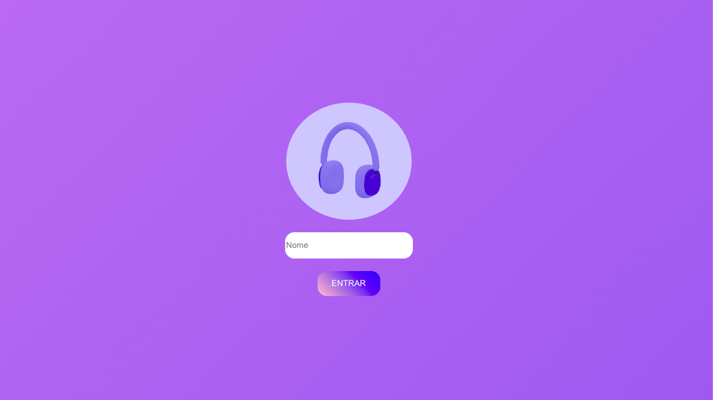
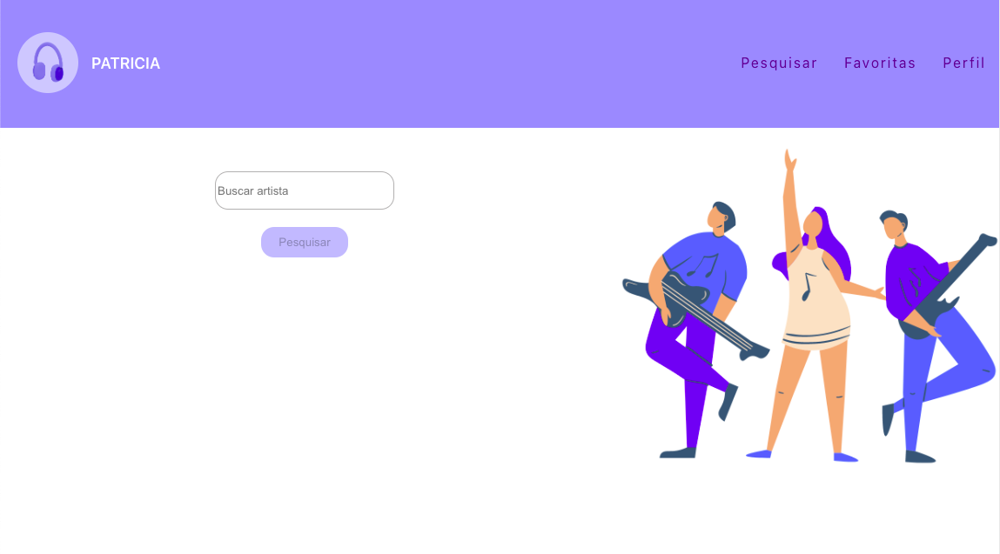
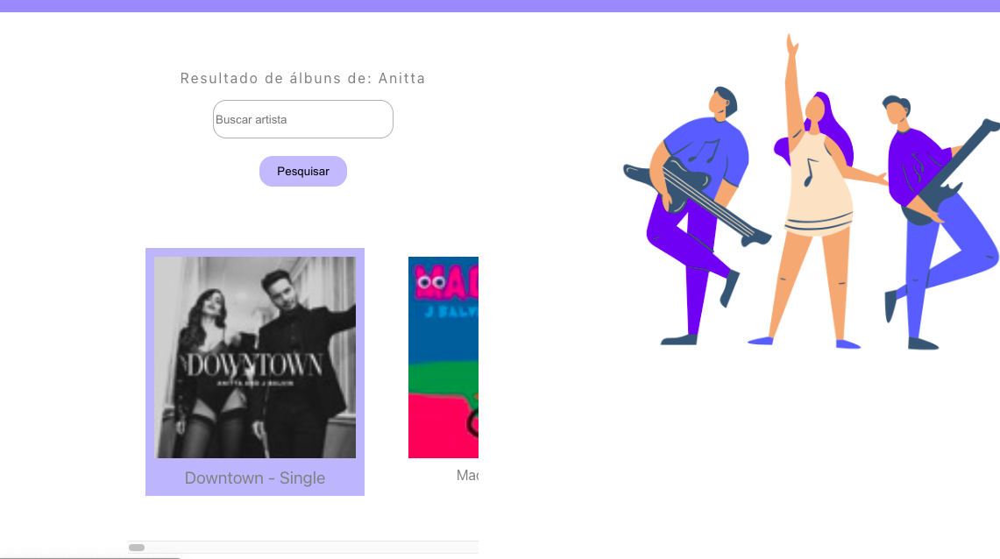

### Projeto realizado durante o módulo de Front-end na Trybe 💚

### Tecnologias utilizadas:

  
  
  

### Sobre o desenvolvimento:
- Foi um projeto desenvolvido individualmente, com o usado de uma API de música;

- Nesse projeto foram necessárias as seguintes habilidade:
* Fazer requisições e consumir dados vindos de uma API;

* Utilizar os ciclos de vida de um componente React;

* Utilizar a função setState de forma a garantir que um determinado código só é executado após o estado ser atualizado

* Utilizar o componente BrowserRouter corretamente;

* Criar rotas, mapeando o caminho da URL com o componente correspondente, via Route;

* Utilizar o Switch do React Router

* Usar o componente Redirect pra redirecionar para uma rota específica;

* Criar links de navegação na aplicação com o componente Link;

[Deploy do projeto - MyMusicApp](https://my-music-app-zeta.vercel.app/) 

